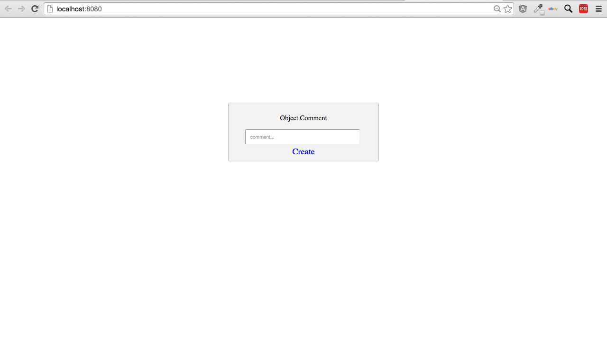

# starterTemplate-Object-Comments
a Javascript starter template for creating object comments using the Stamplay SDK

**NOTE: Users must be logged in to use the comment function!**

**CLONING: When cloning this repo, you must initialize your app first to make it work.**

 1) **Initialize the front-end of your app with Stamplay**
 <br>
- Go to your command line and enter **stamplay init**
- When prompted, enter your **appID** & **API Key**

2) **Initialize the SDK library in your app**
<br>
- In your index.html file, enter the SDK cdn script (or install with bower if you prefer)
```
<script src="//drrjhlchpvi7e.cloudfront.net/libs/stamplay-js-sdk/1.3.1/stamplay.min.js"></script>

```
```
$ bower install stamplay-js-sdk
```
- In your Javascript file, enter the initialization script at the top of the file
```
Stamplay.init('yourAppId');
```
3) **Establish object to be commented on**
- Go to your Stamplay editor and go to the **Data** section. Then go to **Objects**
- Establish which object in the collection your going to comment on by getting it's object **Id**.

4) **comment( )**
```
function createObjectComment(){
	var newComment = document.getElementById('comment').value;
	
	var objectInstance = new Stamplay.Cobject('objectModel').Model;
	objectInstance.fetch('id').then(function(){
    	return objectInstance.comment(newComment).then(function(){
    		alert('Comment created!');
    	});
    });
}
```


